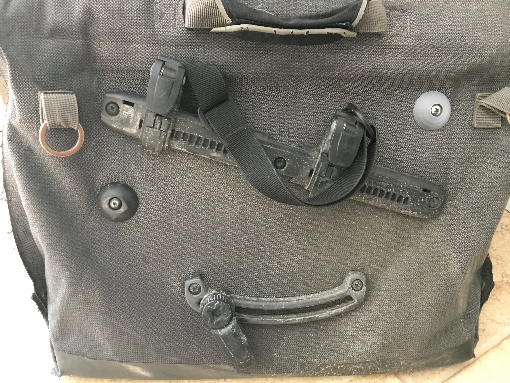

## Replacement blank cap
This part accepts a 1/2" "#10 pan-head sheet metal screw. The hole in the nut will take a small hex 
key to stop rotation during assembly.
`nut.stl`: replacement for Ortlieb part number E205  
`blank.stl`: as far as I can tell, Ortlieb does not sell this part except in a set with shoulder strap E213

